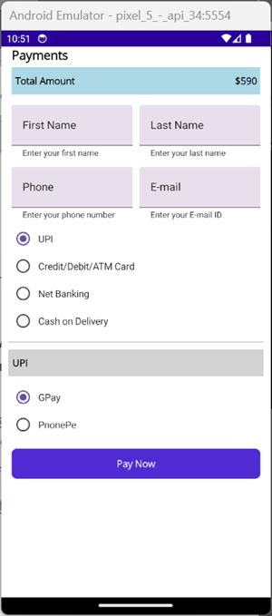

# Implementing Payment Method Selection:
In this example, I will demonstrate how to implement payment method selection using the .NET Maui Radio button. Follow the steps below to create a project and implement payment selection from the available options using Maui Radio Buttons.

## Create a Simple Maui RadioButton 

Start by referring to the Syncfusion .NET MAUI RadioButton documentation to create a MAUI application and include the RadioButton components. The IsChecked property is used to indicate whether the payment method is selected among the available options.

```
<buttons:SfRadioButton Text="UPI" IsChecked="True"/>
```

## Group Radio Buttons

You can group a set of radio buttons using a SfRadioGroup element. It's a container that ensures only one radio button can be selected within the same group.

```
<buttons:SfRadioGroup>
     <buttons:SfRadioButton Text="UPI" IsChecked="True" />
     <buttons:SfRadioButton Text="Credit/Debit/ATM Card" />
     <buttons:SfRadioButton Text="Net Banking" />
     <buttons:SfRadioButton Text="Cash on Delivery" />
 </buttons:SfRadioGroup>
```

##	Select Payment Options
You can choose any of the available payment options and take the necessary actions in the StateChanged event. This event is triggered when the IsChecked state changes.

```
<buttons:SfRadioGroup>
    <buttons:SfRadioButton Text="UPI" StateChanged="PaymentOption_Selected" IsChecked="True"/>
    <buttons:SfRadioButton Text="Credit/Debit/ATM Card" StateChanged="PaymentOption_Selected"/>
    <buttons:SfRadioButton Text="Net Banking" StateChanged="PaymentOption_Selected"/>
    <buttons:SfRadioButton Text="Cash on Delivery" StateChanged="PaymentOption_Selected"/>
</buttons:SfRadioGroup>
```
 
 ```
private void PaymentOption_Selected(object sender, StateChangedEventArgs e)
{
     // Add your code here
}

```

##	Customize the Payment Form
In this example, I enhanced the payment form UI by adding text input layout controls for entering the name, mobile number, and email ID. Additionally, I created different sections for each payment option as shown below.



 


